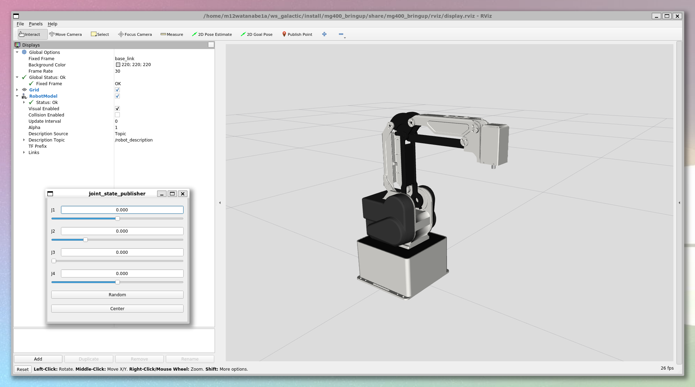

[](https://opensource.org/licenses/Apache-2.0)

# MG400_ROS2

Dobot MG400 ROS2 Repository.



## Repository Status

| ROS2 Distro | Branch | Build status |
| --- | --- | --- |
| **galactic** | [`galactic`](https://github.com/HarvestX/MG400_ROS2/tree/galactic) | [](https://github.com/HarvestX/MG400_ROS2/actions/workflows/ci_galactic.yml?branch=main)
| **humble** | [`humble`](https://github.com/HarvestX/MG400_ROS2/tree/humble) | [](https://github.com/HarvestX/MG400_ROS2/actions/workflows/ci_humble.yml?branch=humble)


## Requirements

- ROS 2
  - Ubuntu20 : [Galactic Geochelone](https://docs.ros.org/en/galactic/Installation.html)
  - Ubuntu22 : [Humble Hawksbill](https://docs.ros.org/en/humble/Installation.html)
- MG400
  - [Firmware version 1.5.6.0](https://forum.dobot.cc/t/the-mg400-and-m1-pro-1-5-6-0-controller-versions-are-released/5923/2)

## Install

### Locate package in workspace

```bash
mkdir -p ~/ws_ros2/src
cd ~/ws_ros2/src
git clone git@github.com:HarvestX/MG400_ROS2.git
```

### Run script to install dependencies

```bash
source /opt/ros/$ROS_DISTRO/setup.bash
cd ~/ws_ros2/src/MG400_ROS2
./setup.bash
exec -l $SHELL
```

## Build Source

Open new terminal and type followings.

```bash
source /opt/ros/$ROS_DISTRO/setup.bash
cd ~/ws_ros2
colcon build
```

## Connect to MG400

Connect PC and MG400 to the same Ethernet via LAN cable.
MG400 needs the emergency stop switch.

### IP address settings

Set the PC's Ethernet IPv4 IP address to a fixed IP somewhere on `192.168.1.0/24` other than `192.168.1.6`.

No need to fill in the "Gateway" and "DNS".


Check the circle light on the base of MG400 blink blue.

## Launch ROS2 Packages

Before launch MG400 scripts, open new terminal and type followings.

```bash
source ~/ws_ros2/install/setup.bash
```

### Launch display (It works without hardware.)

This command display the robot state with Rviz2.
MG400 has parallel links, so the custom joint state publisher is used.

```bash
ros2 launch mg400_bringup display.launch.py
```

### Launch main system (MG400 should be connected via LAN cable.)

This command will start service server to operate MG400 via ROS2 service.

```bash
ros2 launch mg400_bringup main.launch.py
```

Available services are listed [here](./mg400_node/README.md).

#### Test the sample program

Launch main system with other terminal.
Allow enough space around the robot as it moves.

```bash
./sample.bash
```

## Running Utilities

### TCP Packet Checker

```bash
ros2 run mg400_interface show_realtime_data
```

## References

### Official ROS1 package

- [Official ROS1 package](https://github.com/Dobot-Arm/MG400_ROS)
- [Connection trouble shooting](https://drive.google.com/file/d/1XZdcXGPddbkGDYDBaovpLm1Mz8kck3Tj/view)
