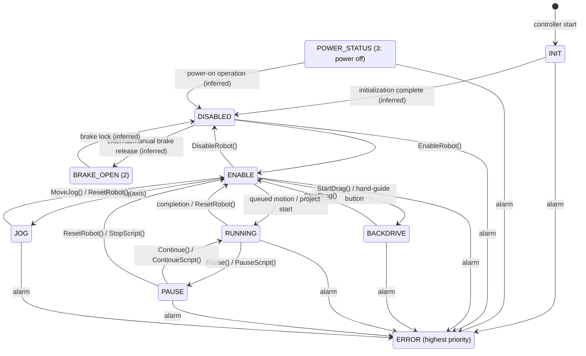

# MG400 Embedded State and ROS 2 Servo Control State Design

## Purpose

This document organizes the states exposed by the MG400 controller through its TCP/IP interface and defines the state-management policy for adding `ServoJ` / `ServoP` to the ROS 2 layer.

This document covers two types of state:

- **MG400 embedded state**: State reported by the controller through `RobotMode()` and the real-time feedback field `RobotMode`. ROS 2 cannot modify or extend these states.
- **ROS 2 control state**: Logical state maintained by the ROS 2 driver for mutual exclusion, stream monitoring, and API admission control. The Servo modes introduced by this document belong to this category.

## Sources and Scope

The following sources were used for this investigation:

1. The official Dobot **TCP_IP Remote Control Interface Guide (4axis)** from the Download Center (published April 24, 2024; document revised April 19, 2024; applicable to four-axis controller V1.6.0.0). Section 2.3, `RobotMode`, is treated as the authoritative definition of MG400 states.
2. [Dobot MG400 User Guide V1.5](./Dobot-MG400-Hardware-User-Guide.pdf) (March 20, 2023). The "Emergency" section and the indicator-light descriptions in Section 3.1, "Robot base," were reviewed.
3. [Dobot TCP_IP Remote Control Interface Guide V4.6.0](./Dobot%20TCP_IP%20Remote%20Control%20Interface%20Guide%20V4.6.0_20250115_en.pdf) (January 15, 2025). The `ServoJ` / `ServoP` commands in Section 2.7 were reviewed as a reference specification.
4. This repository's [`RobotMode.msg`](../mg400_msgs/msg/RobotMode.msg), [`realtime_data.hpp`](../mg400_interface/include/mg400_interface/tcp_interface/realtime_data.hpp), and [`mg400_node.cpp`](../mg400_node/src/mg400_node.cpp). These were reviewed to establish how the definitions map to the current ROS 2 implementation.

The V4.6.0 guide explicitly states that it applies to **six-axis robot controller V4.6.0**. In contrast, the MG400 uses a four-axis controller, and this repository targets firmware V1.5.6.0 as stated in [`README.md`](../README.md). The command list in the four-axis MG400 guide does not include `ServoJ` / `ServoP`. Therefore, the presence of these commands in the V4.6.0 guide alone does not guarantee MG400 support or a compatible argument format. Compatibility must be verified on the target hardware before implementation begins.

## Embedded States Exposed by the MG400

`RobotMode()` in the four-axis MG400 guide returns the values below. It is a single, non-hierarchical enumeration exposed to external clients, not a complete representation of the controller's internal state machine.

| Value | Four-axis guide definition | Meaning | Current `RobotMode.msg` |
| ---: | --- | --- | --- |
| 1 | `ROBOT_MODE_INIT` | Initializing | `INIT` |
| 2 | `ROBOT_MODE_BRAKE_OPEN` | Brake released | `BRAKE_OPEN` |
| 3 | `ROBOT_MODE_POWER_STATUS` | Robot power off | `POWER_STATUS` |
| 4 | `ROBOT_MODE_DISABLED` | Robot disabled; brake not released | `DISABLED` |
| 5 | `ROBOT_MODE_ENABLE` | Robot enabled and idle; no project running and no active alarm | `ENABLE` |
| 6 | `ROBOT_MODE_BACKDRIVE` | Drag/hand-guiding mode | `BACKDRIVE` |
| 7 | `ROBOT_MODE_RUNNING` | Executing trajectory playback/interpolation, a motion command, a project, or similar work | `RUNNING` |
| 8 | `ROBOT_MODE_RECORDING` | Recording a trajectory | `RECORDING` |
| 9 | `ROBOT_MODE_ERROR` | An uncleared alarm exists; value 9 takes precedence over other states | `ERROR` |
| 10 | `ROBOT_MODE_PAUSE` | Paused | `PAUSE` |
| 11 | `ROBOT_MODE_JOG` | Jogging | `JOG` |

`RobotMode.msg` also defines `INVALID = 12`, but 12 is not present in the four-axis guide's embedded-state list. It must be treated only as a ROS-side sentinel value, not as an official state returned by the MG400.

### Incompatibilities with the Six-Axis V4 Guide

State numbers from the V4.6.0 guide must not be applied to the MG400. In particular, the following values have different meanings:

| Value | Four-axis MG400 guide | Six-axis V4.6.0 guide |
| ---: | --- | --- |
| 8 | `RECORDING` | `SINGLE_MOVE` |
| 11 | `JOG` | `COLLISION` |

State checks in the ROS 2 implementation must use definitions fixed to the target product and firmware.

### Relationship to the Base Indicator Light

The indicator-light descriptions in the MG400 User Guide supplement the exposed states as follows. The documentation does not define a one-to-one mapping between the light and `RobotMode`, so the light should be treated only as supporting diagnostic information.

| Indicator | Robot state |
| --- | --- |
| Flashing white | System starting |
| Solid blue | Startup complete; robot disabled |
| Flashing blue | Hand guiding |
| Solid green | Robot enabled; project stopped |
| Flashing green | Project running automatically |
| Solid red | General alarm |
| Flashing red | Position-limit alarm |

## State Transitions Reconstructed from the Public Specifications

Dobot documentation does not provide an official MG400 state-transition diagram. The following diagram is an externally observable model reconstructed from the `RobotMode` descriptions and the preconditions and effects of individual commands. It does not guarantee the transitions used by the controller's internal implementation.



Important considerations when handling these transitions are:

- `EnableRobot()` is required before executing queued commands such as motion commands.
- `Pause()` / `Continue()` pause and resume motion queues submitted over TCP, while `PauseScript()` / `ContinueScript()` pause and resume a project. `ResetRobot()` stops the robot and clears the planned queue.
- `StartDrag()` / `StopDrag()` enter and leave drag mode. The four-axis guide does not identify a public TCP transition into `BRAKE_OPEN`.
- After an emergency stop, the robot is powered off and enters an alarm state. The hazard and emergency stop must be cleared, followed by alarm clearance, power restoration, and enabling the robot again. The four-axis guide does not include the `PowerOn()` command documented in the V4.6.0 guide.
- Because `ERROR` has display priority, `RobotMode()` alone cannot recover the operating state that existed immediately before the error.
- Transitions into and out of `RECORDING` are omitted from the diagram because they could not be established from the TCP/IP documentation reviewed.

## Current ROS 2 Implementation

Currently, [`RealtimeFeedbackTcpInterface`](../mg400_interface/include/mg400_interface/tcp_interface/realtime_feedback_tcp_interface.hpp) stores `robot_mode` from the real-time packet received on port 30004, and `MG400Node` publishes it unchanged to the `robot_mode` topic every 100 ms. A plugin for the `RobotMode()` service also exists, but it is not loaded by default. When explicitly loaded, it uses a separate path that queries port 29999.

This implementation only transports the MG400 embedded state. It does not maintain a state representing the ROS 2 motion owner or control mode. Each motion plugin primarily checks the connection state and `RobotMode::ENABLE` independently, so mutual exclusion between a Servo stream and regular `MovJ`, `MovL`, Jog, or `CommandQueue` operations cannot be managed centrally.

In addition, the current port 30003 implementation only sends commands and does not read responses. Compared with the existing low-frequency commands, a 33 Hz Servo stream would continuously accumulate unread responses. The response-receiving mechanism must therefore be designed first, both to detect command acceptance and errors and to prevent exhaustion of the TCP receive buffer.

## ROS 2 Servo Control State Design

### Basic Policy

Servo modes must be implemented as ROS 2-owned control states rather than as new numeric values in the MG400 `RobotMode`. The embedded state and ROS control state must be stored as independent state variables and published separately.

`ENABLE` and `RUNNING` are `RobotMode` values observed from the MG400; they are not child states of the ROS control state. Because Servo processing is identical in both states, they are treated as a set of `RobotMode` values accepted by the common `SERVO` parent state.

The proposed logical hierarchy is:

```text
ROS control state
├── UNAVAILABLE             Disconnected, disabled, in error, etc.
├── IDLE                    Servo does not own control (a regular-motion lease may exist)
└── SERVO                   ROS 2 exclusively owns online trajectory following
    ├── SERVO_J             Joint-space following
    └── SERVO_P             Cartesian-space following
```

Starting `SERVO` requires `RobotMode=ENABLE(5)`. Because the hardware may report `RobotMode=RUNNING(7)` after a Servo command is sent, the allowed set of `RobotMode` values during Servo operation is defined as:

```text
SERVO_ALLOWED_ROBOT_MODES = { ENABLE, RUNNING }
```

A change between `ENABLE` and `RUNNING` during `SERVO` is not considered a ROS control-state transition. Servo ownership, periodic transmission, the watchdog, and target admission remain active. `SERVO` is exited only when a value outside the allowed set is observed.

### State Transitions and Guards

| Transition | Condition | Action |
| --- | --- | --- |
| `UNAVAILABLE -> IDLE` | Connected, embedded state is `ENABLE`, and no error exists | Allow Servo start requests |
| `IDLE -> UNAVAILABLE` | Communication loss, alarm, emergency stop, or robot disabled | Reject Servo start requests |
| `IDLE -> SERVO_J` | Connected, embedded state is `ENABLE`, no error exists, and no other motion owner exists | Acquire Servo ownership and start the watchdog |
| `IDLE -> SERVO_P` | Same as above | Same as above |
| `SERVO_J/P -> SERVO_J/P` (internal change) | Embedded state is `ENABLE` or `RUNNING` | Preserve the control state, Servo ownership, periodic processing, and watchdog |
| `SERVO_J/P -> IDLE` | Explicit stop request | Stop accepting new targets, stop safely, and release ownership |
| `SERVO_J/P -> UNAVAILABLE` | Communication loss, alarm, emergency stop, robot disabled, or an embedded state outside the allowed set | Stop accepting targets immediately and send a stop command only when possible |
| `SERVO_J/P -> IDLE` | Target-update timeout | Stop through the watchdog, publish diagnostics, and release ownership |

For safety, the initial implementation must not allow a direct switch between `SERVO_J` and `SERVO_P`; it must return to `IDLE` first. While Servo is active, new regular motion, Jog, and `CommandQueue` requests must be rejected. Conversely, a Servo start request must be rejected while a regular motion is executing. This decision must be centralized in a single state-management component shared through `MG400Interface`, rather than distributed among individual plugins.

### Regular-Motion Lease Policy

`MovJ`, `MovL`, `JointMovJ`, `MovJIO`, `MovLIO`, `CommandQueue`, and non-stop
`MoveJog` requests share the `REGULAR_MOTION` owner in `ControlStateManager`.
This owner is represented by a unique lease ID; it is not a new ROS control
state. The visible control state remains `IDLE`, while the owner and lease
prevent both Servo admission and a second regular-motion request.

An Action server must acquire its lease atomically before returning
`ACCEPT_AND_EXECUTE`. The lease is reserved by Action goal UUID until
`handle_accepted` transfers it to that goal's execution context. TF results and
other converted targets belong to the same immutable context and must not be
stored in a callback-shared target member. Validation performed after
acquisition is covered by the lease, so validation failure releases ownership
without accepting the goal.

The execution context owns the lease through RAII from admission until normal
completion, abort, exception, connection failure, or another early exit.
Releasing a foreign or stale ID is an error and cannot affect a newer owner.
Connection loss or an unsafe embedded mode may revoke ownership first; the
later RAII release is then reported diagnostically and remains harmless.

Action cancellation only records the client's request. The current Motion APIs
do not contain a verified safe cancellation command, so accepting cancellation
must not release the lease or guess a controller stop operation. Execution
continues observing the robot and releases the lease only after the existing
terminal condition is reached (or after connection/error handling revokes it).

`CommandQueue` acquires exactly one lease for the complete queue. Commands
inside the queue do not reacquire ownership, and the lease remains held across
all batches until every command finishes or queue execution fails.

`MoveJog(axis)` acquires and persistently retains one regular-motion lease.
Subsequent direction changes reuse that lease. `MoveJog()` is the stop command;
after sending it, the implementation must receive a successful port 30003
response and observe `RobotMode=ENABLE` before releasing the lease. Both checks
use one explicit `steady_clock` deadline. A timeout, controller error, or loss
of stop confirmation retains ownership (fail-closed). A disconnect may cause
`ControlStateManager` to revoke the old lease; its stale ID must never release
ownership obtained after reconnection.

### ROS Interface Direction

- The existing `mg400_msgs/msg/RobotMode` for embedded state must be limited to representing wire values.
- A separate ROS control-state message containing `UNAVAILABLE`, `IDLE`, `SERVO_J`, and `SERVO_P` must be published on a transient-local state topic. `ENABLE` and `RUNNING` must not be duplicated in this message; they remain represented by the existing `RobotMode` message.
- A `ServoJ` target contains four joint angles in radians. A `ServoP` target uses `geometry_msgs/PoseStamped`, with position in meters and orientation as a quaternion. Only the yaw component of the orientation is used for the MG400.
- The MG400 does not support the optional `t`, `aheadtime`, or `gain` arguments. The firmware rejects a `ServoJ` or `ServoP` command if it includes any of these arguments, so the ROS messages and generated TCP commands must omit them.
- Servo start and stop are requested through the `ChangeControlState` service. Permitted requested transitions are `IDLE -> SERVO_J`, `IDLE -> SERVO_P`, and `SERVO_J/P -> IDLE`. A transition to `UNAVAILABLE` or a direct transition between Servo types cannot be requested. Target points are received through streaming topics.
- A target-topic subscriber must retain only the latest value, while dedicated steady-clock periodic processing sends it to port 30003 at a fixed rate. A service call must not be used to send each point.
- A watchdog timeout that detects publisher loss or stopped target updates is a required parameter.
- Servo ownership must be unique. Even if multiple publishers are allowed, targets from anything other than the current owner must be rejected using a session ID or lease.
- The embedded `RobotMode`, ROS control state, most recent command time, watchdog state, and most recent TCP response error must be observable as diagnostic information.

### ServoJ / ServoP Reference Specification

In the six-axis V4.6.0 guide, the Servo commands are dynamic-following commands submitted periodically to the queue on port 30003. The following points are common to both commands:

- The recommended call frequency is 33 Hz (a 30 ms period).
- The commands are not affected by the global speed rate but remain constrained by the robot's speed limits.
- Preplanning the speed of the points and sending them at fixed intervals is recommended.

These optional parameters are part of the six-axis V4.6.0 reference specification only. They are not supported by the MG400: its firmware rejects the entire `ServoJ` or `ServoP` command when `t`, `aheadtime`, or `gain` is present.

`ServoJ` performs joint-space following, while `ServoP` performs Cartesian-space following. However, the signatures in this guide contain six components for six-axis robots. The required four-joint or `X,Y,Z,R` argument format and return values for the MG400 must be fixed in the ROS interface based on responses from the actual MG400 firmware. The unsupported optional parameters must not be added to the MG400 command format.

## Pre-implementation Verification

Do not finalize the public Servo API until all of the following conditions have been satisfied:

1. Record the exact firmware version of the target MG400.
2. Enter TCP control mode while the robot is disabled, enable it, and verify in a sufficiently slow and safe environment whether `ServoJ` / `ServoP` are recognized.
3. Verify the number of required arguments accepted by the MG400, their units, and the response format. Do not send `t`, `aheadtime`, or `gain`; the MG400 firmware rejects commands containing these unsupported parameters.
4. Record the observed `RobotMode` transitions after the first Servo command, during continuous transmission, on timeout, during a stop operation, and after completion.
5. Determine how to stop a Servo stream. Decide whether `ResetRobot()`, a target-firmware-specific stop mechanism, or the controller's timeout behavior should be used for normal and abnormal stops. Do not assume that the `Stop()` command from the six-axis V4 guide is applicable without verification.
6. Continue reading responses from port 30003 during 33 Hz transmission, and verify error responses, latency, dropped responses, and reconnection behavior.
7. Verify that the robot stops safely in each of the following cases: communication loss, publisher termination, ROS node termination, alarm, emergency stop, and robot disable.

## References

- [Dobot Download Center (filtered for MG400)](https://www.dobot-robots.com/service/download-center?products%5B%5D=51)
- [Dobot MG400 product page](https://www.dobot-robots.com/products/desktop-four-axis/mg400.html)
- [TCP/IP Remote Control Interface Guide (4axis) mirror](https://manuals.plus/m/cae4c7dd735846994598e02b25a34eac944652e73cdee34cc71220fb87f623a0)
