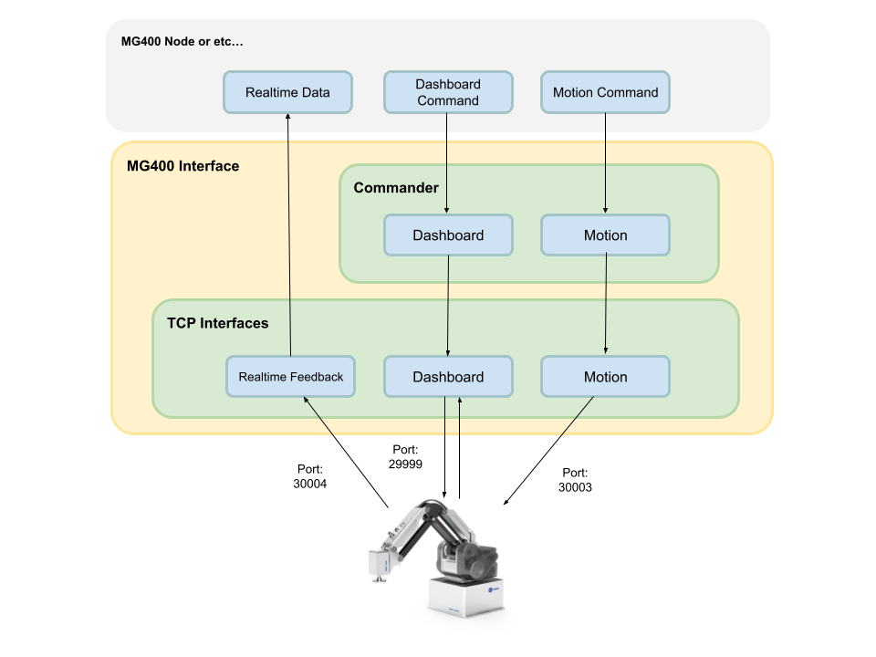

# MG400 Interface
MG400 interface library package.
This package provide interface library to connect with Dobot MG400 via TCP communication protocols.

## Command Support Status
### Dashboard Command
| Status               | Command           |
| -------------------- | ----------------- |
| :heavy_check_mark:   | EnableRobot       |
| :heavy_check_mark:   | DisableRobot      |
| :heavy_check_mark:   | ClearError        |
| :heavy_check_mark:   | ResetRobot        |
| :heavy_check_mark:   | SpeedFactor       |
| :white_large_square: | User              |
| :white_large_square: | Tool              |
| :white_large_square: | RobotMode         |
| :white_large_square: | PayLoad           |
| :white_large_square: | DO                |
| :white_large_square: | AccJ              |
| :white_large_square: | AccL              |
| :white_large_square: | SpeedJ            |
| :white_large_square: | SpeedL            |
| :white_large_square: | Arch              |
| :white_large_square: | CP                |
| :white_large_square: | RunScript         |
| :white_large_square: | StopScript        |
| :white_large_square: | PauseScript       |
| :white_large_square: | ContinueScript    |
| :white_large_square: | SetCollisionLevel |
| :white_large_square: | GetAngle          |
| :white_large_square: | GetPose           |
| :white_large_square: | EmergencyStop     |
| :white_large_square: | ModbusCreate      |
| :white_large_square: | ModbusClose       |
| :white_large_square: | GetInBits         |
| :white_large_square: | GetInRegs         |
| :white_large_square: | GetCoils          |
| :white_large_square: | SetCoils          |
| :white_large_square: | GetHoldRegs       |
| :white_large_square: | SetHoldRegs       |
| :heavy_check_mark:   | GetErrorID        |
| :white_large_square: | DI                |

### Motion Command
| Status               | Command      |
| -------------------- | ------------ |
| :heavy_check_mark:   | MovJ         |
| :heavy_check_mark:   | MovL         |
| :white_large_square: | JointMovJ    |
| :white_large_square: | MovLIO       |
| :white_large_square: | MovJIO       |
| :white_large_square: | Arc          |
| :heavy_check_mark:   | MoveJog      |
| :white_large_square: | Sync         |
| :white_large_square: | RelMovJUser  |
| :white_large_square: | RelMovLUser  |
| :white_large_square: | RelJointMovJ |

## References
- [MG400 Documents](https://www.dropbox.com/s/3sqgd2eew244fyf/TCPIP%20Protocol%20%20for%20CR%20Robot%20V2.0.pdf?dl=0)