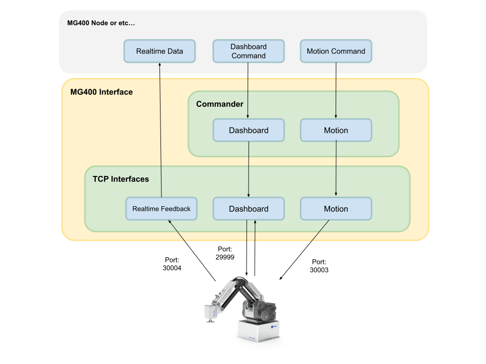

# MG400 Interface
MG400 interface library package.
This package provide interface library to connect with Dobot MG400 via TCP communication protocols.

## Command Support Status
### Dashboard Command
| Status               | Command           |
| -------------------- | ----------------- |
| :heavy_check_mark:   | EnableRobot       |
| :heavy_check_mark:   | DisableRobot      |
| :heavy_check_mark:   | ClearError        |
| :heavy_check_mark:   | ResetRobot        |
| :heavy_check_mark:   | SpeedFactor       |
| :heavy_check_mark:   | User              |
| :heavy_check_mark:   | Tool              |
| :heavy_check_mark:   | RobotMode         |
| :heavy_check_mark:   | PayLoad           |
| :heavy_check_mark:   | DO                |
| :heavy_check_mark:   | ToolDOExecute     |
| :heavy_check_mark:   | ToolDI            |
| :heavy_check_mark:   | AccJ              |
| :heavy_check_mark:   | AccL              |
| :heavy_check_mark:   | SpeedJ            |
| :heavy_check_mark:   | SpeedL            |
| :white_large_square: | Arch              |
| :heavy_check_mark:   | CP                |
| :white_large_square: | RunScript         |
| :white_large_square: | StopScript        |
| :white_large_square: | PauseScript       |
| :white_large_square: | ContinueScript    |
| :heavy_check_mark:   | SetCollisionLevel |
| :heavy_check_mark:   | GetAngle          |
| :heavy_check_mark:   | GetPose           |
| :heavy_check_mark:   | PositiveSolution  |
| :heavy_check_mark:   | InverseSolution   |
| :heavy_check_mark:   | EmergencyStop     |
| :white_large_square: | ModbusCreate      |
| :white_large_square: | ModbusClose       |
| :white_large_square: | GetInBits         |
| :white_large_square: | GetInRegs         |
| :white_large_square: | GetCoils          |
| :white_large_square: | SetCoils          |
| :white_large_square: | GetHoldRegs       |
| :white_large_square: | SetHoldRegs       |
| :heavy_check_mark:   | GetErrorID        |
| :heavy_check_mark:   | DI                |

### Motion Command
| Status               | Command      |
| -------------------- | ------------ |
| :heavy_check_mark:   | MovJ         |
| :heavy_check_mark:   | MovL         |
| :heavy_check_mark:   | JointMovJ    |
| :heavy_check_mark:   | MovLIO       |
| :heavy_check_mark:   | MovJIO       |
| :white_large_square: | Arc          |
| :heavy_check_mark:   | MoveJog      |
| :heavy_check_mark:   | Sync         |
| :heavy_check_mark:   | RelMovJUser  |
| :heavy_check_mark:   | RelMovLUser  |
| :heavy_check_mark:   | RelJointMovJ |

## References
- [MG400 Documents](https://www.dropbox.com/s/3sqgd2eew244fyf/TCPIP%20Protocol%20%20for%20CR%20Robot%20V2.0.pdf?dl=0)

## Motion response handling

`MotionTcpInterface` has one background reader for port 30003. It accumulates
TCP bytes until the documented `;` terminator, handles split and combined TCP
reads, and limits an individual response to 4096 bytes by default. The existing
`MotionCommander` command methods remain asynchronous and keep their original
`void` API. Callers that need completions can use `tryTakeResponse()` or
`waitForResponse()`; diagnostic callers can use `getLatestResponse()`,
`getLatestError()`, and `getPendingCommandCount()`.

The protocol has no request ID. The controller documentation says that each
received command produces a response which echoes the submitted command, but
does not explicitly guarantee response ordering. The implementation therefore
keeps the FIFO correlation assumption in one place and verifies the echoed
command name. A parse or command-name mismatch closes that connection rather
than correlating subsequent responses speculatively.

The default pending and completed queue limits are 256 and 512. A full pending
queue rejects the new command with `MotionCommandQueueFullException`. A full
completed queue replaces its oldest entry so existing fire-and-forget clients
can run continuously; this is never silent: the cumulative count is available
through `getDroppedCompletedResponseCount()` and warnings are emitted. Pending
timeouts use `steady_clock` (one second by default). A timeout resets the TCP
connection so a late response cannot be assigned to a later command. EOF,
receive errors, send errors, and explicit disconnect complete all remaining
pending commands as disconnected before a new connection generation is used.
