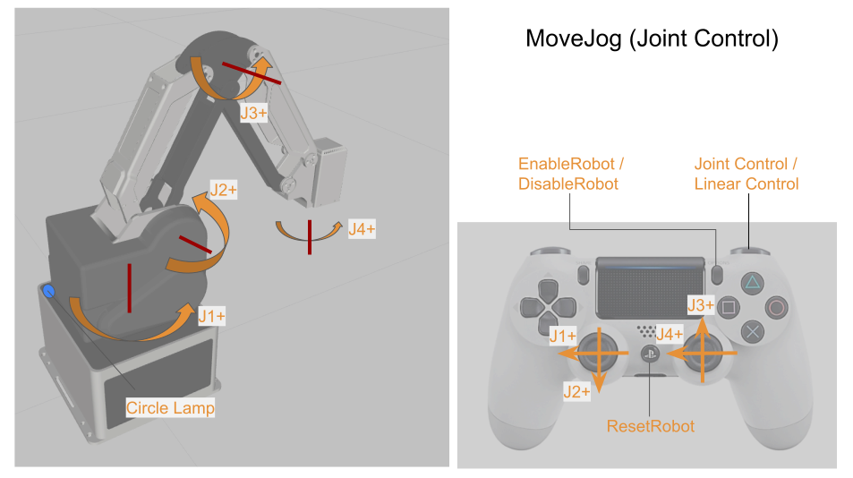
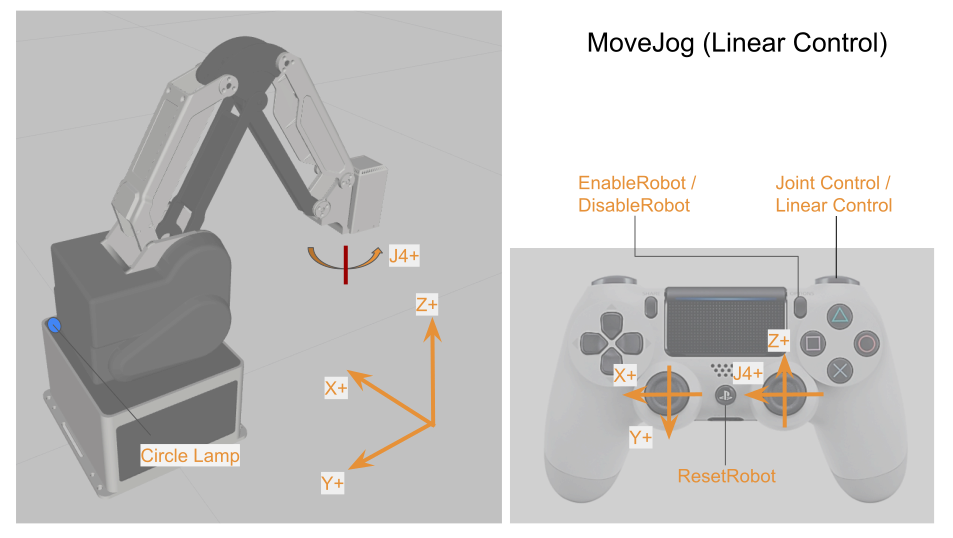

# mg400_joy
Dobot MG400 ROS2 Repository with Joy-con.


## Launch
```bash
$ ros2 launch mg400_bringup joy.launch.py
```

## Description
Create `MoveJog` service call by joy sticks.
By default, call `MoveJog` with joint number argument.

R1 button makes the arguments linear direction (certacian) and toggle control each time pressed.

## Buttons  and Communication Protocol

| Target          | Commands                     | Description                         |
| --------------- | ---------------------------- | ----------------------------------- |
| PS              | `ResetRobot`                 | the robot stops its current action  |
| Start           | `EnableRobot / DisableRobot` | toggle enable and disable the robot |
| R1              | -                            | toggle joint and linear control     |

### MoveJog (Joint Control)
| Target          | Commands                     | Description                         |
| --------------- | ---------------------------- | ----------------------------------- |
| Left Stick ←    | `MoveJog(j1+)`               | jogging while stick tilted          |
| Left Stick →    | `MoveJog(j1-)`               | jogging while stick tilted          |
| Left Stick ↑    | `MoveJog(j2-)`               | jogging while stick tilted          |
| Left Stick ↓    | `MoveJog(j2+)`               | jogging while stick tilted          |
| Right Stick ←   | `MoveJog(j4+)`               | jogging while stick tilted          |
| Right Stick →   | `MoveJog(j4-)`               | jogging while stick tilted          |
| Right Stick ↑   | `MoveJog(j3+)`               | jogging while stick tilted          |
| Right Stick ↓   | `MoveJog(j3-)`               | jogging while stick tilted          |
| (Release Stick) | `MoveJog()`                  | stop jogging                        |

See the figure below.


### MoveJog (Linear Control)
| Target          | Commands                     | Description                         |
| --------------- | ---------------------------- | ----------------------------------- |
| Left Stick ←    | `MoveJog(X+)`                | jogging while stick tilted          |
| Left Stick →    | `MoveJog(X-)`                | jogging while stick tilted          |
| Left Stick ↑    | `MoveJog(Y-)`                | jogging while stick tilted          |
| Left Stick ↓    | `MoveJog(Y+)`                | jogging while stick tilted          |
| Right Stick ←   | `MoveJog(j4+)`               | (same as joint control)             |
| Right Stick →   | `MoveJog(j4-)`               | (same as joint control)             |
| Right Stick ↑   | `MoveJog(Z+)`                | jogging while stick tilted          |
| Right Stick ↓   | `MoveJog(Z-)`                | jogging while stick tilted          |
| (Release Stick) | `MoveJog()`                  | stop jogging                        |

See the figure below.
